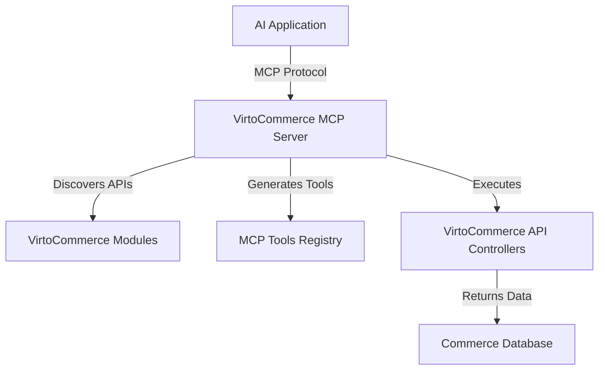

# VirtoCommerce MCP Server Module

[](https://github.com/VirtoCommerce/vc-module-mcp-server/actions?query=workflow%3ACI) [](https://sonarcloud.io/dashboard?id=VirtoCommerce_vc-module-mcp-server) [](https://sonarcloud.io/dashboard?id=VirtoCommerce_vc-module-mcp-server) [](https://sonarcloud.io/dashboard?id=VirtoCommerce_vc-module-mcp-server) [](https://sonarcloud.io/dashboard?id=VirtoCommerce_vc-module-mcp-server)

## Overview

The VirtoCommerce MCP Server module provides a **Model Context Protocol (MCP)** server implementation that enables AI applications and Large Language Models (LLMs) to interact with VirtoCommerce APIs through a standardized interface.

### What is Model Context Protocol (MCP)?

Model Context Protocol (MCP) is an open protocol that standardizes how applications provide context to Large Language Models (LLMs). It enables secure integration between LLMs and various data sources and tools, allowing AI applications to:

- Access real-time data from external systems
- Execute functions and operations
- Provide context-aware responses
- Build composable AI workflows

### Why VirtoCommerce MCP Server?

This module bridges VirtoCommerce's e-commerce capabilities with AI applications by:

- **Exposing VirtoCommerce APIs as MCP Tools**: Automatically discover and expose API endpoints from installed VirtoCommerce modules
- **Enabling AI-Powered Commerce**: Allow AI applications to interact with products, orders, customers, and other commerce entities
- **Standardized Integration**: Use the industry-standard MCP protocol for seamless integration with AI tools like Claude, ChatGPT, and custom AI applications
- **Real-time Data Access**: Provide LLMs with up-to-date commerce data for context-aware responses

### Key Features

- ✅ **MCP 1.0 Compatible**: Implements the latest Model Context Protocol specification
- ✅ **Auto-Discovery**: Automatically discovers and exposes API endpoints from VirtoCommerce modules
- ✅ **Tool Generation**: Converts API controllers and methods into MCP tools with proper schemas
- ✅ **Secure by Design**: Implements proper authentication and authorization
- ✅ **Multi-Database Support**: Works with SQL Server, MySQL, and PostgreSQL
- ✅ **Extensible**: Easy to extend with custom tools and capabilities

## Installation

### Prerequisites

- VirtoCommerce Platform 3.876.0 or later
- .NET 8.0 or later
- One of the supported databases (SQL Server, MySQL, or PostgreSQL)

### Install Module

1. **Download**: Download the module package from the [releases page](https://github.com/VirtoCommerce/vc-module-mcp-server/releases)

2. **Install via Admin Panel**:
   - Go to **Settings → Modules**
   - Click **Install from file**
   - Upload the module package
   - Restart the application

3. **Install via CLI**:
   ```bash
   vc-build install-module -PackagePath VirtoCommerce.McpServer.zip
   ```

### Configuration

After installation, configure the module in **Settings → MCP Server**:

- **Enable MCP Server**: Turn on the MCP server functionality
- **Configure Security**: Set up authentication and permissions as needed

## Usage

### Connecting AI Applications

Once installed, the MCP server will be available and can be connected to various AI applications:

#### Claude Desktop Integration

Add to your Claude Desktop MCP configuration:

```json
{
  "mcpServers": {
    "virtocommerce": {
      "command": "dotnet",
      "args": ["run", "--project", "path/to/VirtoCommerce.McpServer"],
      "env": {
        "VIRTOCOMMERCE_URL": "https://your-vc-instance.com",
        "VIRTOCOMMERCE_API_KEY": "your-api-key"
      }
    }
  }
}
```

#### Custom AI Applications

Use any MCP-compatible client library to connect:

```csharp
var transport = new StdioClientTransport("dotnet", ["run", "--project", "VirtoCommerce.McpServer"]);
var client = await McpClientFactory.CreateAsync(transport);

// List available tools
var tools = await client.ListToolsAsync();

// Call a tool
var result = await client.CallToolAsync("get_products", new Dictionary<string, object>
{
    ["take"] = 10,
    ["skip"] = 0
});
```

### Available Tools

The module automatically generates MCP tools from your VirtoCommerce API endpoints. Examples include:

- **Product Management**: `get_products`, `create_product`, `update_product`
- **Order Operations**: `get_orders`, `process_order`, `update_order_status`
- **Customer Management**: `get_customers`, `create_customer`, `update_customer`
- **Inventory Operations**: `check_inventory`, `update_stock`

*Note: Available tools depend on the modules installed in your VirtoCommerce instance.*

## Development

### Prerequisites for Development

- Visual Studio 2022 or Visual Studio Code
- .NET 8.0 SDK
- VirtoCommerce Platform development environment

### Building from Source

1. **Clone the repository**:
   ```bash
   git clone https://github.com/VirtoCommerce/vc-module-mcp-server.git
   cd vc-module-mcp-server
   ```

2. **Build the solution**:
   ```bash
   dotnet restore
   dotnet build
   ```

3. **Run tests**:
   ```bash
   dotnet test
   ```

### Project Structure

```
src/
├── VirtoCommerce.McpServer.Core/          # Core business logic and services
│   ├── Services/
│   │   └── McpServerService.cs            # Main MCP server implementation
│   └── ModuleConstants.cs                 # Module constants and settings
├── VirtoCommerce.McpServer.Data/          # Data layer and EF Core context
├── VirtoCommerce.McpServer.Data.SqlServer/ # SQL Server provider
├── VirtoCommerce.McpServer.Data.MySql/    # MySQL provider
├── VirtoCommerce.McpServer.Data.PostgreSql/ # PostgreSQL provider
└── VirtoCommerce.McpServer.Web/           # Web module and API controllers
    ├── Controllers/Api/                   # REST API controllers
    ├── Scripts/                          # Frontend JavaScript
    └── Module.cs                         # Module initialization
```

### Extending the Module

#### Adding Custom Tools

Create custom MCP tools by implementing the tool interface:

```csharp
[McpServerToolType]
public static class CustomTools
{
    [McpServerTool, Description("Get recommended products for a customer")]
    public static async Task<string> GetRecommendations(string customerId, int count = 5)
    {
        // Your custom logic here
        return "Recommendation results";
    }
}
```

#### Customizing API Discovery

Override the default API discovery behavior:

```csharp
public class CustomApiDiscovery : IApiDiscoveryService
{
    public IEnumerable<ApiEndpoint> DiscoverEndpoints(Assembly assembly)
    {
        // Custom discovery logic
    }
}
```

## Architecture

### MCP Server Flow



### Key Components

- **McpServerService**: Main service that implements the MCP protocol
- **API Discovery**: Automatically discovers controllers and methods from loaded modules
- **Tool Generation**: Converts API endpoints into MCP tool definitions
- **Request Handling**: Routes MCP tool calls to appropriate API endpoints
- **Security**: Handles authentication and authorization

## Scenarios

### E-commerce AI Assistant

Build an AI assistant that can help customers and staff with:

1. **Product Discovery**: "Find wireless headphones under $100"
2. **Order Management**: "Check the status of order #12345"
3. **Inventory Queries**: "How many iPhone 15 cases do we have in stock?"
4. **Customer Support**: "What's the return policy for electronics?"

### Business Intelligence

Create AI-powered analytics and reporting:

1. **Sales Analysis**: "What were our top-selling products last month?"
2. **Customer Insights**: "Show me customers who haven't ordered in 6 months"
3. **Inventory Optimization**: "Which products are overstocked?"

### Automated Operations

Implement AI-driven business processes:

1. **Smart Reordering**: Automatically reorder products based on sales trends
2. **Customer Service**: Auto-respond to common customer inquiries
3. **Price Optimization**: Adjust prices based on market conditions

## API Reference

The module exposes standard VirtoCommerce REST APIs through the MCP protocol. All endpoints are automatically documented via Swagger:

**Swagger Documentation**: `https://your-instance.com/docs`

Key API endpoints include:
- `/api/mcp-server` - MCP server status and configuration
- Standard VirtoCommerce APIs exposed as MCP tools

## Database Model

The module uses minimal database storage for configuration and caching:


## Security Considerations

- **Authentication**: Supports API key and OAuth authentication
- **Authorization**: Respects VirtoCommerce permission system
- **Tool Safety**: All tools require appropriate permissions
- **Data Privacy**: Follows VirtoCommerce data protection policies

## Contributing

We welcome contributions! Please see our [Contributing Guide](CONTRIBUTING.md) for details.

### Development Workflow

1. Fork the repository
2. Create a feature branch
3. Make your changes
4. Add tests
5. Submit a pull request

### Reporting Issues

Please report issues on our [GitHub Issues](https://github.com/VirtoCommerce/vc-module-mcp-server/issues) page.

## Support

- **Documentation**: [VirtoCommerce Docs](https://docs.virtocommerce.org)
- **Community**: [VirtoCommerce Community](https://www.virtocommerce.org/community)
- **Commercial Support**: [Contact VirtoCommerce](https://virtocommerce.com/contact-us)

## Roadmap

- [ ] Enhanced tool generation with better schema inference
- [ ] Support for MCP resources and prompts
- [ ] Integration with VirtoCommerce AI features
- [ ] Advanced caching and performance optimizations
- [ ] Support for webhooks and real-time updates

## Related Resources

- [Model Context Protocol Specification](https://spec.modelcontextprotocol.io/)
- [VirtoCommerce Platform Documentation](https://docs.virtocommerce.org)
- [MCP Tools and Integrations](https://github.com/modelcontextprotocol)

## License

Copyright (c) Virto Solutions LTD. All rights reserved.

Licensed under the Virto Commerce Open Software License (the "License"); you
may not use this file except in compliance with the License. You may
obtain a copy of the License at

<https://virtocommerce.com/open-source-license>

Unless required by applicable law or agreed to in writing, software
distributed under the License is distributed on an "AS IS" BASIS,
WITHOUT WARRANTIES OR CONDITIONS OF ANY KIND, either express or
implied.
